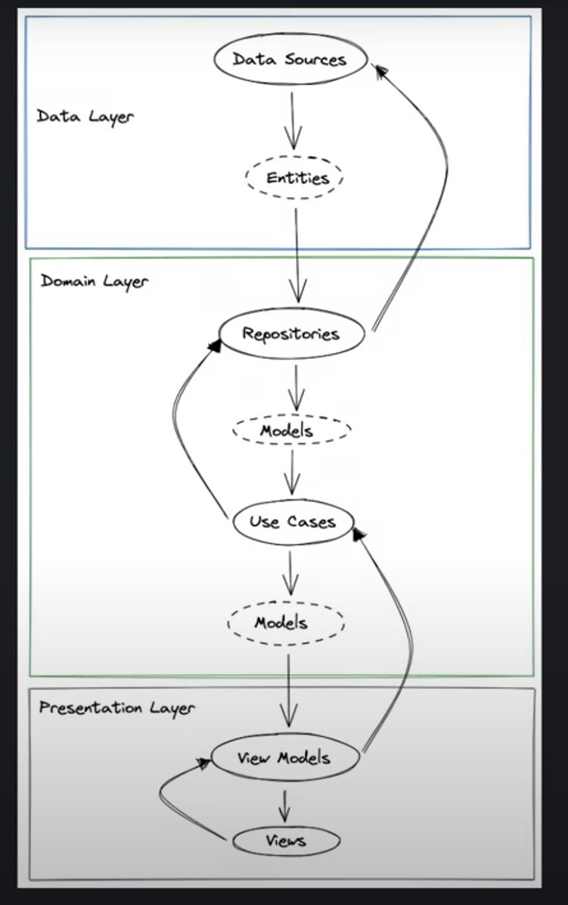
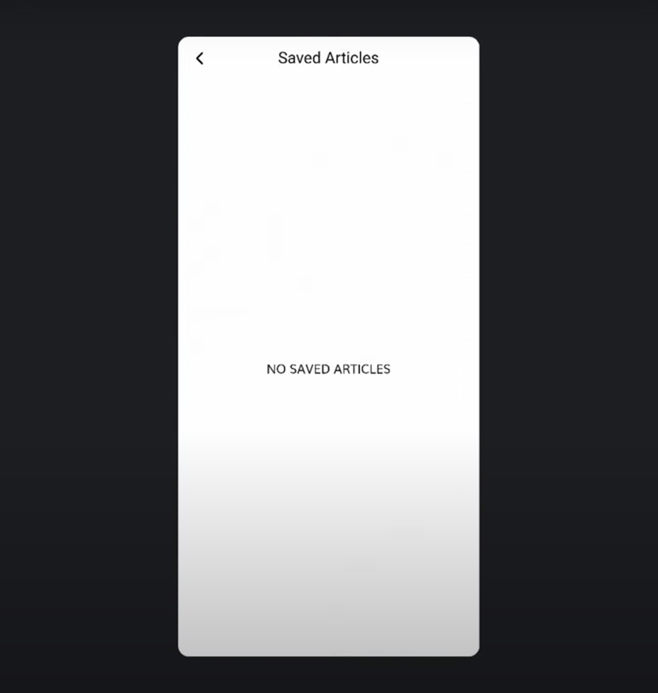
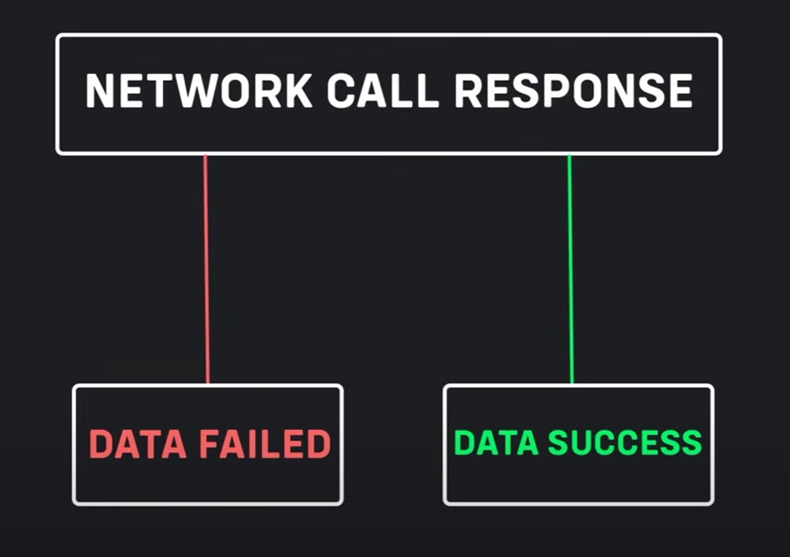
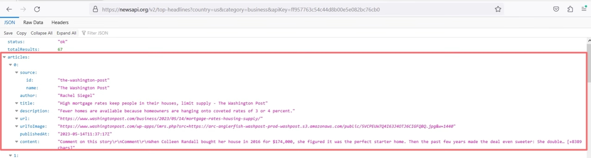

# Flutter Clean Architecture Project One

After finishing a full stack course with flutter, bloc state management, and somewhat cool backend which I thought I'd never say yeah PHP laravel, finally It's time to dive into FCA projects. So here we go first project.

## Clean Architecture?

Clean architecture is the blueprint for a modular system, which strictly follows the design principle called separation of concerns. 

More specificly this style of architecture focusses on dividing softares into layers to simplify the development and maintenance of the system itself. 

When layers are well separated individual pieces can be used as well as developed and updated independently. 

## Architecture

There are three main layers. 

1. **Data** layer
   1. entities
2. **Domain** layer
   1. repositories
   2. models
   3. use cases
   4. models
3. **Presentation** / **Feature** layer.
   1. view models
   2. views



There's also two two additional suppoerting **layers** 

1. RESOURCES
2. SHARED LIBRARY

## Presentation Layer

This layer presents the **app contents** and triggers **events** that modify the application "State". 

This Layer has three parts
1. PAGES 
   > includes application pages
   
2. STATE MANAGEMENT 
   > includes files related to state management. {Bloc, Riverpod, ...}

3. WIDGETS
   
   > Includes all the specific widgets we use on the pages.

# Domain Layer

Domain layer is the innermost layer and has no dependecy on other layers. It contains:

1. ENTITIES
2. REPOSITORY INTERFACES
3. USE CASES
   
The domain layer is written in pure dart without any flutter ui elements. The domain layer should only be concerned with the business logic of the application not with the eimplementation details. 

## Entites

The **Entities** must be our `data types` classes that are used in differnt parts of the software. 

We define in our version of clean that entities are objects that can be returned to us or we can send to an API.

## Repository Interfaces

Repositories and domain layer are **abstract classes** or **contracts** and definds the properties and methods that the project will need in a specific feature.

## Use Cases

USE CASES include applicaiton specific business rules. Each event is an interaction with user with the system and we can call this a **use case**.

For example sign up log in and other interactions.

Use cases are nothing more than a bridge between layers. It's a `single call` to `business logic`.

# Data Layer

DATA LAYER the data module which is a part of the outermost layer which is responsible for data **retrieval**.

This can be in the form of API calls to a server

or

a local database.

It also contains `repository implementations` this layer has three parts:

1. REPOSITORIES 
   
    >This includes actual implementations of the repositories in the domain layer.

    > Repositories are responsible to coordinate data from the data sources

2. DATA SOURCES

   > It consists remote and local data sources

   > Remote data sources will perform HTTP requests on the API 

   > Local data sources will cache our persist data.

3. MODELS

   > Models are representation of JSON structure and allows us to interact with our data sources. 

# Folder structure. 

Clean architecture folder structure based on `features` based approach. the below example is for feature `auth`. and some additional directory that are part of the architecture are `config` and `core`. 

```
lib
 |- config
 |    |- routes
 |    |- theme
 |- core
 |    |- error
 |    |- network
 |    |- usecases
 |    |- util
 |- features
 |    |- auth
 |        |- data
 |        |    |- data_sources
 |        |    |- models    
 |        |    |- repository    
 |        |- domain
 |        |    |- entities
 |        |    |- repository
 |        |    |- usecases
 |        |- presentation
 |             |- bloc
 |             |- pages
 |             |- widgets
 |- main.dart
 ```
 

# App Interface/s

Some of the screenshots of the app that we're making.

|||
:-:|:-:
  |  
  | 
 

# Pubspec.yaml

Project starter Configuration of pubspec.yaml

## Dependencies

```
  dio: ^
  flutter_bloc: ^8.1.2
  equatable: ^2.0.5
  get_it: ^7.6.0
  intl: ^0.18.1
  floor: ^1.4.2
  retrofit: ^3.0.1
  flutter_hooks: ^0.18.3
  cached_network_image: ^3.2.0
```

## Dev dependencies

```
  retrofit_generator: ^3.0.1+1
  floor_generator: ^1.2.0
  build_runner: ^2.1.2
```

## Fonts

```
  fonts:
    - family: Muli
      fonts:
        - asset: assets/fonts/muli/Muli.ttf
        - asset: assets/fonts/muli/Muli-Bold.ttf
          weight: 700
        - asset: assets/fonts/muli/Muli-Light.ttf
          weight: 300
```

# Making of the project

Domain ---> Enties

## Creating `resources`

but first we'll create resources [data_state.dart](lib/core/resources/data_state.dart).

```
lib
 |- core
 |    |- resources
 |    |      |- data_state.dart
```

in which we'll have the followigs:

``` dart
abstract class DataState<T> {
  final T? data;
  final DioError? error;

  const DataState({this.data, this.error});
}

///
class DataSuccess<T> extends DataState<T> {
  const DataSuccess(T data) : super(data: data);
}

class DataFailed<T> extends DataState<T> {
  const DataFailed(DioError error) : super(error: error);
}

```
above class is for error handling



NOTE: read [data_state.dart](lib/core/resources/data_state.dart). for futher details


## Domain Layer `entities`

What are entities again?

-> `ENTITIES` are **BUSINESS OBJECTS** of an application or a system. 

To define `entities` we can asnwer some of the basic question abou tthe app.

* What are the entities of a news app?
  * `ARTICLE` entity.

* Which fields `ARTICLE` entity must have?
  *  To find answer to that we go to look at the api response.



Now let's create `article` entity [file](lib/features/daily_news/domain/entities/article.dart):

```
lib
 |- features
 |  |- daily_news
 |  |  |- domain
 |  |  |  |- entities
 |  |  |  |  |- article.dart
``` 

I'm not sure why we're using `Equatable` yet but let's see. 

Simple google search gave me the following.

> "The Equatable package provides a convenient way to determine if two objects or instances are equal. It is an essential tool for writing unique applications in Flutter. By using Equatable, you can compare objects without writing lengthy equality comparison codes."  - [dhiwise](https://www.dhiwise.com/post/understanding-the-equatable-package-in-flutter#:~:text=As%20the%20name%20suggests%2C%20the,writing%20lengthy%20equality%20comparison%20codes.)

Example:

`With Equatable`

``` dart
class Person extends Equatable {
  final String name;
  final int age;

  const Person({required this.name, required this.age});

  @override
  List<Object?> get props => [name, age];
}

void main() {
  final person1 = Person(name: 'John', age: 25);
  final person2 = Person(name: 'John', age: 25);

  print('Are person1 and person2 equal? ${person1 == person2}');
}
/// prints true. 
```

from chat gpt the following: `Without Equatable`

``` dart
class Person {
  final String name;
  final int age;

  Person(this.name, this.age);

  @override
  bool operator ==(Object other) =>
      identical(this, other) ||
      other is Person &&
          runtimeType == other.runtimeType &&
          name == other.name &&
          age == other.age;

  @override
  int get hashCode => name.hashCode ^ age.hashCode;
}
```

up until now to my understanding we need it for bloc it seems like.. 

# Create REPOSITORY CLASSES & MODELS

**DOMAIN**---`REPOSITORY`---**DATA**

Repository is the b r i d g e between `DATA` layer and `DOMAIN` layer. 

> They are the actual implementation of the repositories in the DATA layer 

Repositories are responsible for coordinating data from different data sources.

> The repositoroy of the `DOMAIN` layer is in the form of an `abstract` class.

In the abstract class there could be function/s but they need to be implemented elsewhere, elsewhere being the `REPOSITORY` where we implement the `abstract` class that's in `domain` layer.  

So for this app we're creating 

`domain/repository/`[article_repository.dart](lib/features/daily_news/domain/repository/article_repository.dart) 

in which resides the abstract class `ArticleRepository()` which later we implement in `data/repository` but before that we need to have an `article model` which we'd create in 

`data/models/` [article.dart](lib/features/daily_news/data/models/article.dart)

And after that we'll create the `article_repository_impl.dart`

`data/repository`[article_repository_impl.dart](lib/features/daily_news/data/repository/article_repository_impl.dart)

# Make `REQUEST` to `API USING RETROFIT`


# API Key - ec17a2c68fb44bc1827fca9c04ccf12e  


